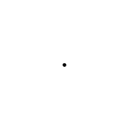

<!DOCTYPE html>

<html lang="en">
<head>
    <meta charset="UTF-8">
    <title>Sample Webpage</title>
    <meta name="viewport" content="width=device-width, initial-scale=1.0">
    
    <link rel="stylesheet" href="https://cdn.jsdelivr.net/npm/katex@0.16.8/dist/katex.min.css">
    
    

</head>
<body>
    <header>
        <h1>Things I have learned in MATH3121 Abstract Algebra so far</h1>
    </header>
    <main>
        <h2>Geometric Construction, Complex Numbers, Polynominals</h2>
        
 
        
 <b>Definition:</b> A geometric object is constructible if it can be obtained by using straightedge and compass only within a finite number of steps.

        
For example, a regular pentagon is constructible as shown below:

        
        <h6>By <a href="https://en.wikipedia.org/wiki/User:TokyoJunkie" class="extiw" title="en:User:TokyoJunkie">TokyoJunkie</a> at the English Wikipedia - <a href="https://en.wikipedia.org/wiki/Image:Pentagon_construct.gif" class="extiw" title="en:Image:Pentagon construct.gif">en:Image:Pentagon_construct.gif</a>, Public Domain, <a href="https://commons.wikimedia.org/w/index.php?curid=829215">Link</a></h6>

        <button onclick="showAlert()">Click Me</button>
    </main>
    
</body>
</html>

## aahdga

